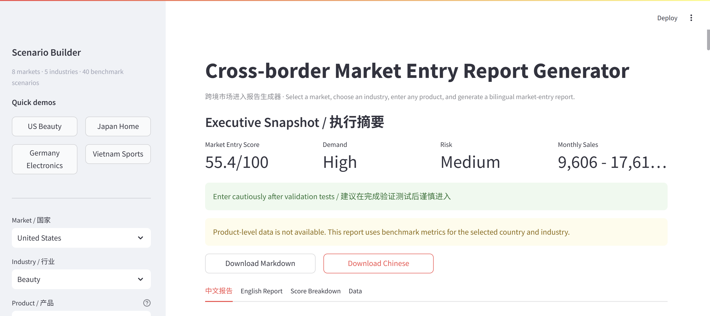
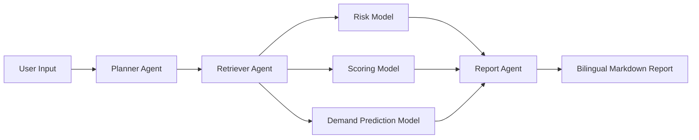
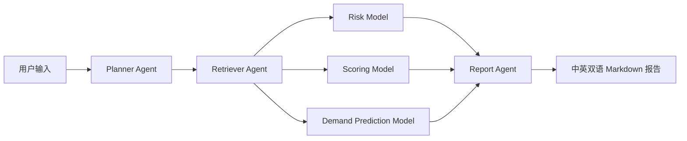

# Market Entry Agent

[English](#project-overview) | [中文](#项目介绍)

## Project Overview

**Authors: Lanting Lu & Yixin Zhang**

An AI-powered multi-agent system that helps cross-border sellers evaluate whether a product is worth entering a target overseas market.

### Live Demo

Live demo: [MarketPilot AI](https://marketpilot-ai-agent.streamlit.app/)



Run `streamlit run app.py` and open `http://localhost:8501` to try the demo locally.

### 1. What It Does

Market Entry Agent turns fragmented market signals into a structured market-entry decision report.

Given a target country, industry, product, and optional platform, the system:

1. normalizes the user request,
2. retrieves structured market and platform context,
3. estimates demand,
4. evaluates business and market-entry risk,
5. calculates a weighted Market Entry Score,
6. generates a client-ready bilingual Markdown report.

The product field is intentionally flexible. Users can enter any product name. If exact product-level data is unavailable, the agent uses benchmark metrics from the selected country and industry, and clearly marks the report as an industry-benchmark analysis.

### 2. Why This Matters

International market-entry decisions usually require combining signals from many places:

- macroeconomic conditions
- ecommerce readiness
- marketplace/platform availability
- category growth
- product pricing
- review volume
- competition level
- logistics complexity
- regulatory risk
- cultural fit

This project demonstrates how an AI Agent workflow can organize these signals into a reproducible, explainable, and presentation-ready decision process.

### 3. Demo Flow

A typical demo story:

```text
A seller wants to launch a product overseas.
They select a target market and industry.
They enter any product name.
The agent generates a bilingual market-entry report with score, demand, risk, and strategy.
```

Example:

```text
Market: United States
Industry: Beauty
Product: Mineral Sunscreen Stick
Platform: Amazon
```

The app returns:

```text
Market Entry Score
Demand Level
Estimated Monthly Sales
Overall Risk
Recommended Entry Strategy
Bilingual Market Entry Report
```

### 4. Agent Workflow



### 5. System Components

| Component | Responsibility |
| --- | --- |
| Planner Agent | Normalizes country, industry, product, and platform input |
| Retriever Agent | Retrieves exact product data or country-industry benchmark data |
| Risk Model | Evaluates saturation, pricing, regulatory, logistics, and cultural-fit risks |
| Scoring Model | Calculates a weighted 0-100 Market Entry Score |
| Demand Prediction Model | Estimates demand index and monthly sales range |
| Report Agent | Generates full Chinese and English reports |
| Streamlit App | Provides the demo website, scenario builder, report preview, and downloads |

### 6. Data Layer

The project supports Excel-based source ingestion. Raw Excel files are placed in:

```text
data/raw/
```

The data processing pipeline reads every workbook and sheet, standardizes fields, preserves source metadata, adds benchmark estimate records, and exports:

```text
data/processed/market_entry_dataset.csv
data/processed/market_entry_dataset.json
data/processed/market_entry_dataset.sqlite
```

Canonical schema:

```text
country
industry
product
platform
metric_name
metric_value
metric_unit
source_name
source_url
source_type
updated_date
notes
```

The current dataset includes structured benchmark scenarios for 8 target markets and 5 industries. These benchmark records are suitable for demo screening and scenario comparison. They should be validated with live marketplace data before real client decisions.

### 7. Tech Stack

- Python
- pandas
- openpyxl
- SQLite
- Streamlit
- pytest
- Markdown report generation
- Rule-based scoring and forecasting models

### 8. How To Run

Install dependencies:

```bash
pip install -r requirements.txt
```

Build the processed dataset:

```bash
python data_processing/build_dataset.py
```

If the `python` command is unavailable on Windows, use the Anaconda interpreter:

```bash
D:\Anaconda\anaconda3\python.exe data_processing\build_dataset.py
```

Run the command-line demo:

```bash
python main.py
```

Run the Streamlit web app:

```bash
streamlit run app.py
```

Run tests:

```bash
pytest
```

### 9. Repository Structure

```text
market-entry-agent/
├── agents/
│   ├── planner_agent.py
│   ├── retriever_agent.py
│   └── report_agent.py
├── data/
│   ├── raw/
│   ├── processed/
│   └── sample/
├── data_processing/
│   ├── build_dataset.py
│   ├── data_cleaner.py
│   ├── data_schema.py
│   └── excel_loader.py
├── models/
│   ├── demand_prediction_model.py
│   ├── risk_model.py
│   └── scoring_model.py
├── docs/
├── outputs/
├── tests/
├── app.py
├── main.py
├── config.py
└── requirements.txt
```

### 10. Future Improvements

- integrate live marketplace APIs such as Amazon, Rakuten, Walmart, Shopee, Lazada, and eBay
- add Google Trends and social media listening signals
- connect World Bank, IMF, OECD, and national statistics APIs
- add PDF export
- support multi-scenario comparison
- add historical report storage
- replace some rule-based formulas with trained ML models
- add an LLM analyst layer for richer narrative reasoning

### Disclaimer

This project is a portfolio-ready AI Agent demo. Some records are benchmark estimates designed for early-stage screening and scenario comparison. They should not be treated as live marketplace data.

---

## 项目介绍

**作者：Lanting Lu & Yixin Zhang**

一个基于 AI 的多智能体系统，帮助跨境卖家评估某一产品是否适合进入目标海外市场，并自动生成中英双语商业分析报告。

### 在线演示 / Live Demo

Live demo: [MarketPilot AI](https://marketpilot-ai-agent.streamlit.app/)

##### Demo Preview / 演示截图


##### Local Demo / 本地运行

本地运行 Streamlit：

```bash
streamlit run app.py
```

然后打开：

```text
http://localhost:8501
```

Demo 网站支持：

- 目标国家和行业选择
- 产品自由输入
- 平台推荐
- 中英双语市场进入报告生成
- Markdown 报告下载

### 项目速览 / Project Snapshot

| 项目 | 说明 |
| --- | --- |
| 项目类型 | AI Agent / Market intelligence / Decision support |
| 核心问题 | 这个产品是否值得进入该海外市场？ |
| 输入 | 目标国家、行业、产品、平台 |
| 输出 | 市场进入评分、需求预测、风险评估、中英双语报告 |
| 当前市场 | United States, Hong Kong, Japan, South Korea, Vietnam, Germany, Netherlands, Malaysia |
| 当前行业 | Beauty, Home & Kitchen, Consumer Electronics, Pet Supplies, Sports & Outdoors |
| 数据层 | Excel 来源数据 + benchmark estimates + processed CSV/JSON/SQLite |
| 界面 | Streamlit Web App + command-line demo |

### 1. 功能概述

Market Entry Agent 是一个面向跨境业务场景的 AI 多智能体系统，用于评估某个产品是否适合进入目标海外市场。

用户选择目标国家和行业，输入任意产品名称后，系统会自动完成：

1. 输入标准化；
2. 结构化市场数据检索；
3. 行业基准数据匹配；
4. 市场需求预测；
5. 市场进入风险评估；
6. Market Entry Score 市场进入评分；
7. 中英双语商业报告生成。

产品字段支持自由输入。如果系统没有该具体产品的精确数据，会自动使用所选国家和行业的 benchmark 指标进行分析，并在报告中明确标注为“行业基准分析”。

### 2. 项目价值

海外市场进入判断通常需要综合大量分散信息，例如：

- 宏观经济条件
- 电商成熟度
- 平台覆盖情况
- 行业增长趋势
- 产品价格区间
- 评论量与评分
- 竞争强度
- 物流复杂度
- 法规风险
- 文化匹配度

本项目展示了如何用 AI Agent 工作流，将这些碎片化信息整理成一套结构化、可解释、可复现、可展示的市场进入决策流程。

### 3. Demo 演示方式

推荐演示故事线：

```text
一个跨境卖家想把产品卖到海外。
他选择目标国家和行业，输入产品名称。
Agent 自动生成中英双语市场进入报告。
报告包含评分、需求预测、风险评估和进入策略建议。
```

示例输入：

```text
国家：United States
行业：Beauty
产品：Mineral Sunscreen Stick
平台：Amazon
```

系统输出：

```text
市场进入评分
需求等级
预计月销量
综合风险
推荐进入策略
中英双语市场进入报告
```

### 4. Agent 工作流程



### 5. 核心模块

| 模块 | 作用 |
| --- | --- |
| Planner Agent | 标准化国家、行业、产品和平台输入 |
| Retriever Agent | 检索精确产品数据，或匹配国家 + 行业 benchmark 数据 |
| Risk Model | 评估市场饱和、价格压力、法规、物流和文化匹配风险 |
| Scoring Model | 计算 0-100 的 Market Entry Score |
| Demand Prediction Model | 预测需求指数和预计月销量区间 |
| Report Agent | 生成完整中文报告和完整英文报告 |
| Streamlit App | 提供网站式 demo、快速场景、报告预览和下载 |

### 6. 数据层说明

项目支持从 Excel 导入平台和来源数据。原始 Excel 文件放在：

```text
data/raw/
```

数据处理流程会读取所有工作簿和工作表，标准化字段，保留来源信息，追加 benchmark estimate 数据，并导出：

```text
data/processed/market_entry_dataset.csv
data/processed/market_entry_dataset.json
data/processed/market_entry_dataset.sqlite
```

统一字段结构：

```text
country
industry
product
platform
metric_name
metric_value
metric_unit
source_name
source_url
source_type
updated_date
notes
```

当前数据集中包含 8 个目标市场和 5 个行业的 benchmark 场景，适合用于 demo、初筛和方案比较。正式用于客户决策前，仍建议接入实时平台数据、搜索趋势、竞品价格、广告成本和法规认证信息。

### 7. 技术栈

- Python
- pandas
- openpyxl
- SQLite
- Streamlit
- pytest
- Markdown 报告生成
- 基于规则的评分与预测模型

### 8. 运行方式

安装依赖：

```bash
pip install -r requirements.txt
```

构建结构化数据集：

```bash
python data_processing/build_dataset.py
```

如果 Windows 上 `python` 命令不可用，可以使用 Anaconda Python。

```bash
python main.py
```

运行 Streamlit Web 应用：

```bash
streamlit run app.py
```

运行测试：

```bash
pytest
```

### 9. 项目结构

```text
market-entry-agent/
├── agents/
│   ├── planner_agent.py
│   ├── retriever_agent.py
│   └── report_agent.py
├── data/
│   ├── raw/
│   ├── processed/
│   └── sample/
├── data_processing/
│   ├── build_dataset.py
│   ├── data_cleaner.py
│   ├── data_schema.py
│   └── excel_loader.py
├── models/
│   ├── demand_prediction_model.py
│   ├── risk_model.py
│   └── scoring_model.py
├── docs/
├── outputs/
├── tests/
├── app.py
├── main.py
├── config.py
└── requirements.txt
```

### 数据说明

本项目是一个适合 portfolio 和 AI Agent 演示的原型系统。部分数据为 benchmark estimate，用于早期市场筛选和场景比较，不应被直接视为实时平台数据。
