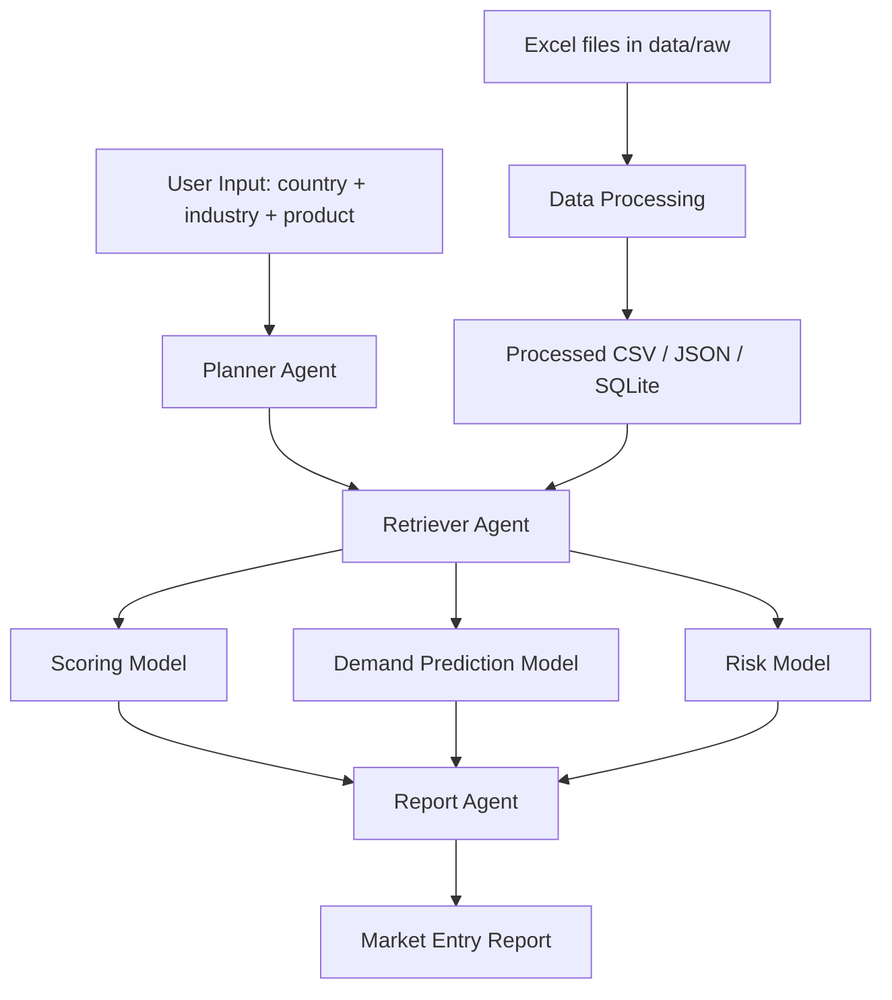

# Workflow Diagram

```mermaid
flowchart TD
    A["User Input: country + industry + product"] --> B["Planner Agent"]
    B --> C["Retriever Agent"]
    C --> D["Scoring Model"]
    C --> E["Demand Prediction Model"]
    C --> F["Risk Model"]
    D --> G["Report Agent"]
    E --> G
    F --> G
    G --> H["Market Entry Report"]

    I["Excel files in data/raw"] --> J["Data Processing"]
    J --> K["Processed CSV / JSON / SQLite"]
    K --> C
```

